<p align="center">
  
</p>

<h1 align="center">QadamSupply</h1>

<p align="center"><b>Менеджер закупа открывает утром один экран и видит, что заказать сегодня, сколько и почему.</b><br>
Расчёт заказов поставщикам для ТОО «Электрокомплект» — на реальных выгрузках 1С, с объяснением каждой цифры.</p>

<p align="center">
  
  
  
  
  
</p>

<p align="center">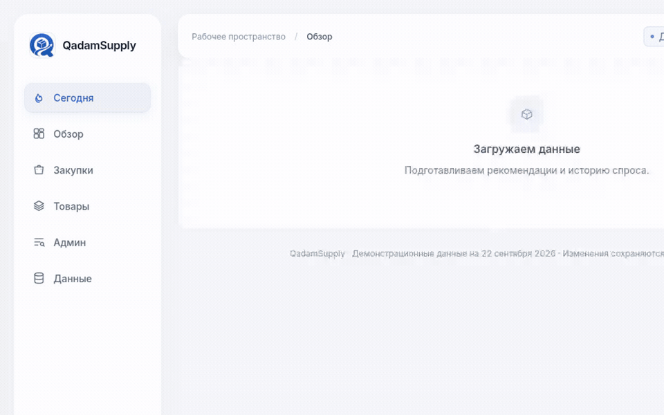</p>
<p align="center"><i>40 секунд без монтажа: «Сегодня» → проверка на истории → разовая сделка на 210 000 шт → карточка до накладной → «что если» → админка</i></p>

---

## Проблема за 20 секунд

Менеджер закупа считает пополнение склада вручную в Excel: 10 000+ строк продаж, остатки, товары в пути, сезонность.
Считает редко — поэтому одного товара лежит на год вперёд, а другого нет. Разовая продажа 210 000 штук одному клиенту
превращает в Excel «средний спрос» в фантастику. Дни, когда товара просто не было на складе, Excel считает «спроса нет».

**QadamSupply** пересчитывает все 3 561 товар двух поставщиков за 1,5 секунды, чистит историю от разовых сделок,
досчитывает спрос за дни без товара, учитывает сезонность, категорию, остатки и путь — и объясняет каждую цифру
так, чтобы менеджер ей поверил и утвердил заказ сам. Поставщику ничего не отправляется: последнее слово за человеком.

## Чем мы отличаемся

| | Обычный «AI для закупок» | QadamSupply |
|---|---|---|
| Откуда цифра | «нейросеть посчитала» | детерминированный расчёт, каждая строка раскрывается до накладной |
| Доверие | «поверьте нам» | **проверено на истории партнёра**: расчёт откатили на 30.05, сверили с фактом июля–августа |
| Первый экран | дашборд с 20 цифрами | **«Что делать сегодня»** — 2–4 дела с кнопкой «в черновик» |
| ИИ | считает заказ | объясняет и отвечает на «что если», **каждое число сверяется с расчётом** |
| Разовые сделки | ломают среднее | накладная 210 000 шт исключена, но видна на графике и в обосновании |
| Управление | правки в коде | админка: сроки, сервис, правила менеджера «минимум N по товару» |
| Язык | «критично», «cover days» | **«закончится 28.09, поставка придёт 17.10 — 19 дней без товара»** и деньги: под риском / заморожено в излишках, ₸ |

## 🧪 Проверено на истории — наш козырь

Мы не просим верить прогнозу. Мы откатили расчёт на **30 мая 2026** (данные до этой даты, без товаров в пути)
и сравнили с тем, что реально случилось на складе в июле–августе:

- на складе закончились **128** товаров, которые до этого продавались;
- **95 из них (74%)** уже стояли бы в списке к заказу за месяц до дефицита: 70 «критично», 10 «высокая», 15 «плановая»;
- **33** система пропустила бы — и мы показываем это честно, а не прячем.

Ложные тревоги мы не считаем: в те месяцы менеджер заказывал сам, и часть «критичных» он просто спас. Цифра
считается на живых данных при каждом запуске, не захардкожена.

<p align="center">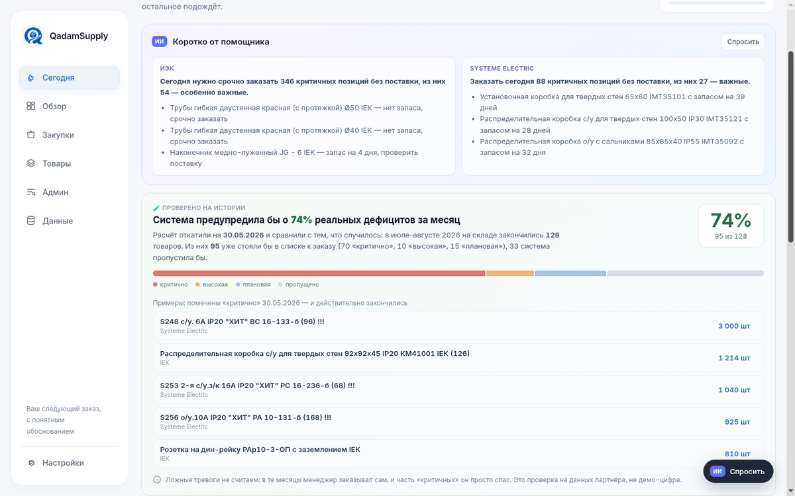</p>

## Что видит менеджер

### 1. «Что делать сегодня» — вместо сухих цифр

Из 3 561 товара система отбирает дела на сегодня: заказать у ИЭК 54 важные позиции (категория A), которые
закончатся раньше поставки и по которым ничего не едет; у Systeme Electric — 27 на 66 млн ₸. Одна кнопка —
и они в черновике. Ниже: что проверить перед заказом, за какими поставками проследить, и что система уже
сделала за вас. Сверху — сводка от ИИ-помощника.

<p align="center">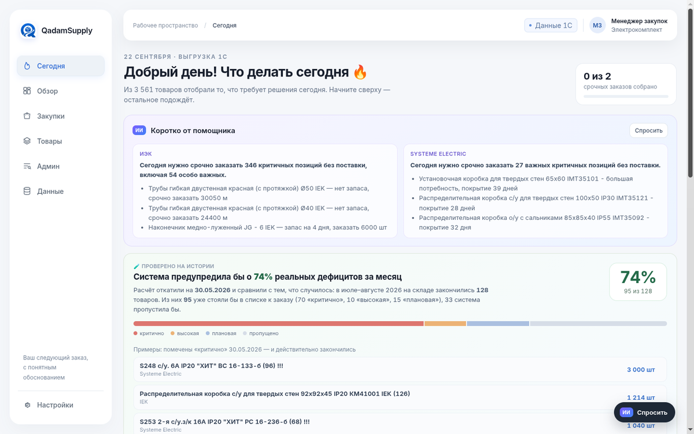</p>

Ниже на том же экране — **деньги**: по Systeme Electric (там есть себестоимость) 58 млн ₸ продаж под риском до
поставки и 24 млн ₸ заморожено в излишках со сроком больше 6 месяцев. Излишки — это деньги, которые можно
не тратить на следующий заказ.

<p align="center">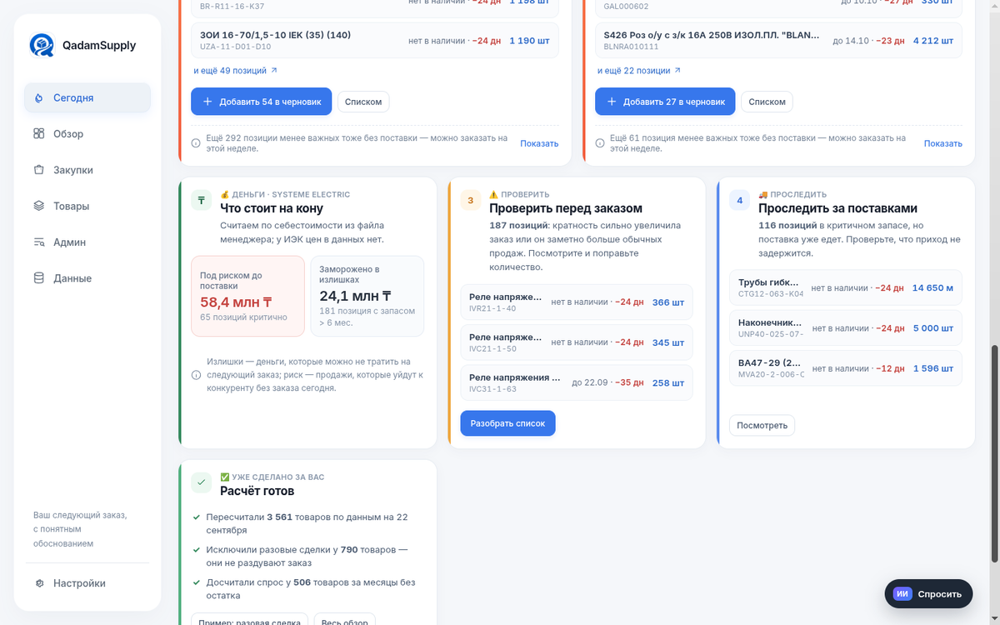</p>

### 2. Карточка товара — «почему именно столько»

Формула вместо чёрного ящика: прогноз + страховой запас − остаток − в пути = потребность → кратность → заказ.
**Каждая строка раскрывается**: прогноз по месяцам с сезонностью, конкретные поставки в пути с датой прихода,
откуда взят остаток, почему такой страховой запас. Есть «Что если…» — сдвинул срок поставки и видишь новое
количество, ничего не сохраняя.

<p align="center">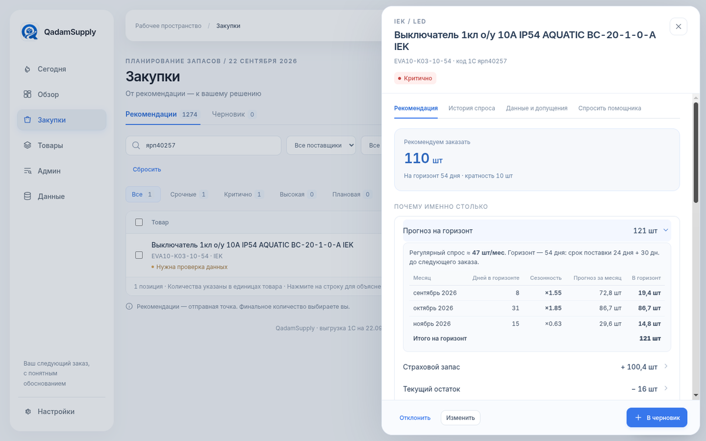</p>

### 3. Разовая сделка на 210 000 штук — найдена и исключена

«Петля металлическая LOOP»: одна накладная 09.06.2025 на 210 000 шт при обычной продаже 1 шт. Excel заказал бы
на годы вперёд. QadamSupply исключает сделку из регулярного спроса, но не прячет: она на графике, с номером
накладной, в обосновании и в отчёте для 1С.

<p align="center">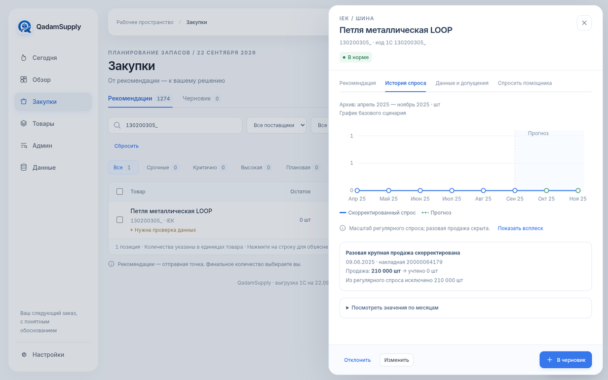</p>

### 4. Закупки, черновик, утверждение

Фильтры по срочности, поставщику, категории важности, «ничего нет в пути», «была разовая сделка».
Правки количества, «Утвердил (ФИО)», XLSX для 1С (лист «Заказ» + лист «Утверждение») и CSV.

<p align="center">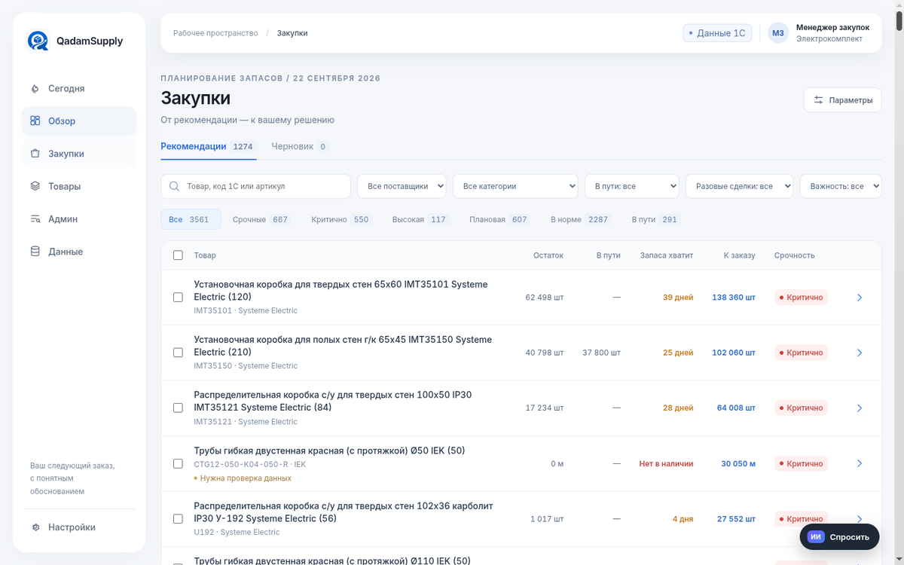</p>

### 5. Обзор и тренды по категориям

<p align="center">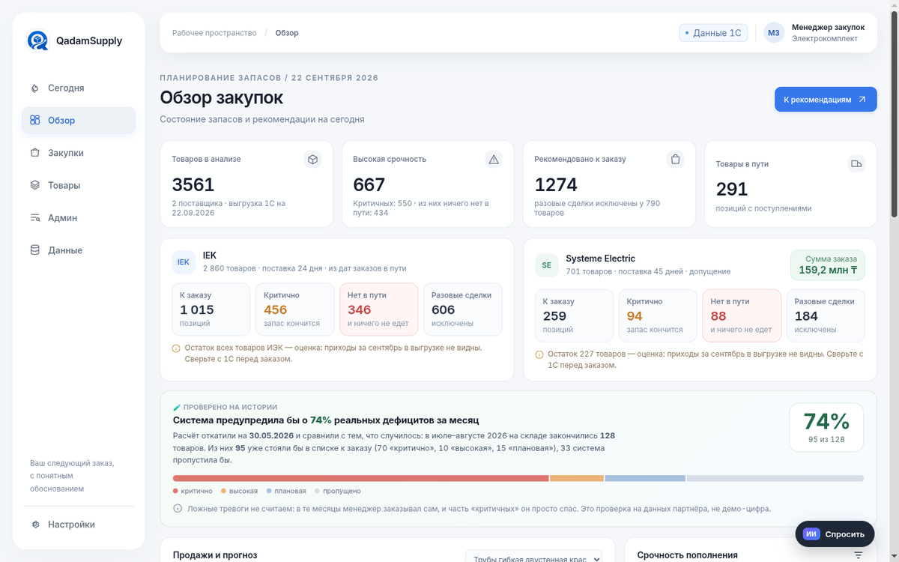</p>

### 6. С телефона — тоже удобно

Таблицы превращаются в карточки, дела на сегодня — в один столбец.

<p align="center">
  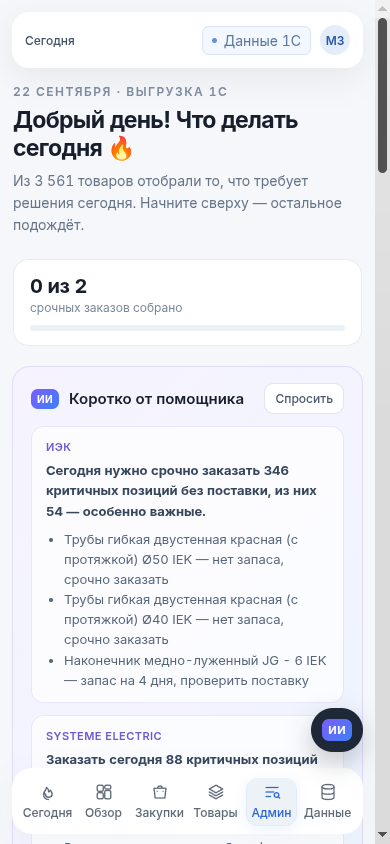
  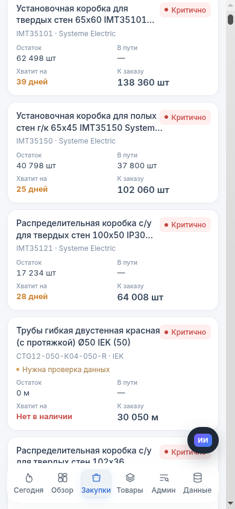
</p>

## 🤖 ИИ, который не придумывает цифры

Количества считает Python. Языковая модель — интерфейс поверх расчёта: сводка на утро, «объясни простыми
словами», чат «с чего начать», «что будет, если поставка задержится». Помощник отвечает только через инструменты
расчёта, **каждое число в ответе сверяется кодом с результатами**, а отправить заказ он не может в принципе.
Без ключа API всё остальное работает.

<p align="center">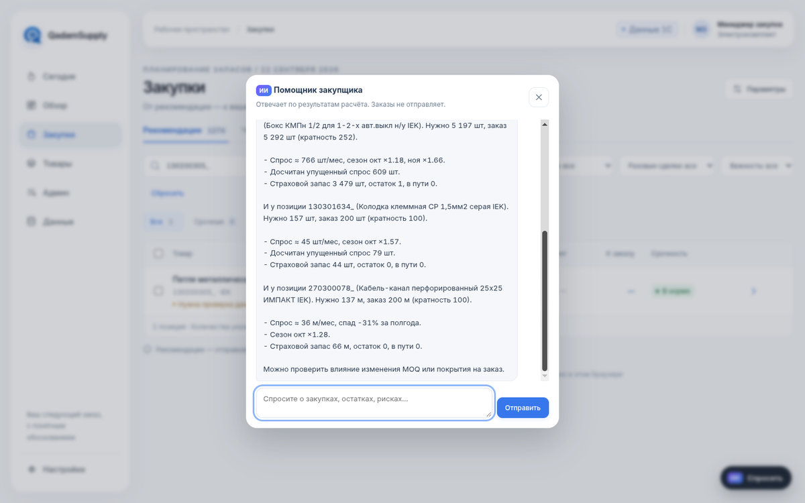</p>

## ⚙️ Админка

Сроки поставки, период заказа, план прироста, уровень сервиса, правила менеджера «минимум N по товару» —
и всё это сразу попадает в расчёт, обоснование и ответы помощника. История расчётов и решений.

<p align="center">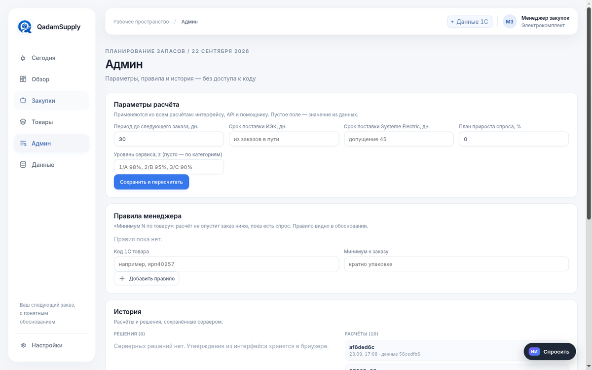</p>

## Как это устроено

```text
выгрузки 1С (продажи, остатки, путь, кратность, сезонность, модель менеджера)
   → загрузчик: файлы по заголовкам, битые файлы не роняют расчёт
   → чистка: разовые накладные, аномальные месяцы, досчёт спроса за stockout
   → прогноз: сезонность (товар → группа → поставщик), тренд, план прироста
   → заказ: горизонт, страховой запас по категории, остаток, путь, кратность
   → обоснование по каждой строке (кодом) → интерфейс / API / ИИ-помощник
```

Python + pandas, FastAPI, чистый JS без сборки, LangGraph-агент, SQLite. Один расчёт для интерфейса, API и агента —
цифры везде одинаковые. 69 автотестов, включая проверки must-have кейса на реальных архивах.

## Демо за 2 минуты

1. «Сегодня» → сводка ИИ → «Добавить 54 в черновик».
2. Карточка выключателя AQUATIC (`ярп40257`): формула, апрель–май без товара досчитаны, «что если» срок 60 дней.
3. «Петля LOOP» (`130200305_`): разовая сделка на 210 000 шт исключена.
4. «Проверено на истории»: 74%.
5. Админка: правило «минимум 500» → заказ пересчитан.
6. Черновик → ФИО → XLSX для 1С.

## Для жюри: проверить за 5 минут

```bash
python3 -m venv .venv && .venv/bin/pip install -r requirements.txt
# архивы партнёра (IEK.zip, Systeme electric.zip) → data/raw/IEK/ и data/raw/SE/ (имена файлов не важны)
.venv/bin/uvicorn api:app --port 8000        # http://127.0.0.1:8000, первый расчёт ~15 с
.venv/bin/python scripts/test_project.py --iek-zip IEK.zip --se-zip "Systeme electric.zip"   # 77 тестов на реальных данных
```

Без архивов: `.venv/bin/python -m pytest -q` (70 тестов на синтетике) и интерфейс в демо-режиме —
`python3 -m http.server -d web 8765`. Ключи AI не нужны: без них работает всё, кроме помощника.

| Must-have кейса | Где в коде | Тест | Что увидеть в интерфейсе |
|---|---|---|---|
| 1. Все источники влияют на результат | `engine/calc.py` → `compute()` | `test_transit_reduces_order`, `test_stock_changes_order`, `test_category_changes_order`, `test_growth_plan_changes_order` | карточка → «Что если…»: +50 в пути → заказ 110 → 60 |
| 2. Сезонность и рост | `engine/calc.py` → `_season_index`, тренд | `test_seasonality_peak`, `test_sustained_growth_is_not_cleaned` | карточка → строка «Прогноз на горизонт»: сен ×1,55, окт ×1,85 |
| 3. Упущенный спрос при stockout | `engine/calc.py` → блок «дефицит» | `test_stockout_restores_demand` | `ярп40257`: апрель–май без товара → досчитано 58 и 65 шт |
| 4. Разовые крупные заказы | `engine/calc.py` → `detect_oneoffs` | `test_one_off_spike_ignored`, `test_regular_bulk_buyer_is_not_one_off` | `130200305_` «Петля LOOP»: 210 000 шт исключены, видны на графике |
| 5. Список по поставщикам с обоснованием | `engine/run.py` → `OrderLine.reason_text` | `test_every_line_explained_and_grouped` | вкладки ИЭК / SE, у каждой строки обоснование до накладной |

Ограничения кейса: отправки поставщику нет (утверждает человек, с ФИО); клиентов в данных нет, разовые
сделки определяются по накладной. Методология и алгоритм выбросов — в технической части ниже.

## Команда

**YeahGrinder**: Аят (расчёт, интеграция, продукт), Аслан (интерфейс, тесты), Алдияр (сервис, агент, трассировка).
Хакатон HackAlem AI, кейс ТОО «Электрокомплект».

---

<details open>
<summary><h2>Техническая часть: запуск, методология, API</h2></summary>

## Запуск

```bash
python3 -m venv .venv
.venv/bin/pip install -r requirements.txt
cp .env.example .env          # ключи AI — по желанию
.venv/bin/uvicorn api:app --port 8000      # HTTP API (/docs) и интерфейс QadamSupply из web/ на http://127.0.0.1:8000
.venv/bin/streamlit run app.py              # запасной интерфейс для аналитика
.venv/bin/python -m pytest -q               # тесты
```

**Данные.** Каждый архив партнёра распаковывается в свою подпапку `data/raw/`: `IEK.zip` →
`data/raw/IEK/`, `Systeme electric.zip` → `data/raw/SE/` (папку `__MACOSX` не нужно). Другая
корневая папка — переменная `DATA_DIR`. Файлы ищутся по началу имени, а если имя не подошло
(в архиве SE имена искажены) — по заголовкам колонок, так что переименовывать ничего не нужно.
Первый разбор xlsx ~15 с, дальше данные читаются из кэша `data/cache/` (~0,3 с) и перечитываются
сами, когда меняются файлы. Данные партнёра в git не попадают.

**Ключи (необязательно):** `OPENAI_API_KEY` + `OPENAI_MODEL` — чат; `NVIDIA_API_KEY` +
`NVIDIA_MODEL` — критик. Ключи только в `.env`, в коде и конфиге их нет.

## Какие данные используются

| Источник | Для чего |
|---|---|
| Динамика продаж (строки накладных) | **основной ряд спроса** с 01.2025 и поиск разовых крупных продаж |
| Ежемесячные продажи | только 2024 год — чтобы хватило истории на сезонность и тренд |
| Ежемесячные остатки (на 1-е число) | месяцы без товара (stockout); текущий остаток ИЭК |
| Товар в пути | вычитается из потребности, если приходит в горизонте; даты заказов ИЭК → срок поставки |
| MOQ / кратность | округление заказа вверх |
| Сезонность | коэффициенты поставщика (с поправкой на неполный сентябрь) |
| Модель менеджера SE (`TDSheet`) | текущий остаток по локациям, категория 1/2/3/5/7, себестоимость |

Источником спроса выбраны накладные: месячный отчёт с ними расходится (у SE — примерно вдвое,
«Петли LOOP» на 210 000 шт. в месячном отчёте нет вовсе), а найти конкретную разовую сделку можно
только по накладным. Изменение любого источника меняет итог — это проверяется тестами (см. ниже).

## Методология расчёта

Один пакет по всем товарам обоих поставщиков, ~1,5 с на 3 561 SKU (`engine/calc.py`).
Для каждого товара по месяцам:

1. **Ряд спроса.** 2024 — из месячного отчёта, 2025+ — сумма строк накладных; возвраты спросом
   не считаются. Текущий месяц неполный (данные до 22.09): в прогноз не входит, используется
   только для оценки текущего остатка ИЭК.
2. **Разовые крупные продажи** исключаются — см. следующий раздел.
3. **Упущенный спрос (stockout).** Месяц дефицитный, если остаток на его начало ≤ 0 **и** продажи
   ниже половины ожидаемых. Ожидаемый спрос = медиана спроса без сезонности по месяцам с товаром
   × сезонность месяца; до него месяц и досчитывается. Если товар пришёл в середине месяца и
   нормально продавался, месяц не трогаем.
4. **Сезонность** — своя у товара, если у него ≥ 18 месяцев продаж и заметный объём (смешивается
   с сезонностью группы 60/40), иначе — группы товаров (префикс кода 1С) внутри поставщика,
   смешанная с сезонностью поставщика. Коэффициент сентября 2026 в файлах партнёра посчитан по
   22 дням — досчитываем ×30/22.
5. **Уровень и тренд.** Уровень — взвешенное среднее спроса без сезонности за 6 последних месяцев
   (свежие весят больше). Тренд — последние 6 месяцев к предыдущим 6, ограничен 0,67…1,5,
   применяется, только если изменение ≥ 10% и совпадает по знаку с годом к году.
   Прогноз месяца = уровень × тренд × (1 + прирост %) × сезонность месяца.
6. **Горизонт** = срок поставки + период до следующего заказа (30 дн.), по календарным дням.
   Срок: ИЭК — из дат заказов в пути (по товару, иначе медиана по поставщику, взвешенная по
   количеству, = 24 дн.); SE — 45 дн., допущение (дат заказа нет). Меняется в интерфейсе и API.
7. **Заказ.**
   ```text
   страховой запас = z(категории) × σ(спроса без сезонности, 12 мес.) × √(горизонт / 30)
   потребность     = прогноз на горизонт + страховой запас − остаток − в пути (приход в горизонте)
   заказ           = 0, если потребность ≤ 0 или спроса почти нет, иначе вверх до кратности
   ```
   **Категория → уровень сервиса:** 1/A — 98%, 2/B/5 — 95%, 3/C — 90%; категория 7 (новинка или
   выведен) — без автозаказа. SE — категории из файла менеджера; у ИЭК категорий нет → ABC по
   числу строк накладных за 12 мес. (80/15/5%): число строк не зависит от единиц шт/м/упак.
8. **Остаток.** SE — как в модели менеджера: свободный + витрина + ТЗ + розничный. ИЭК — оценка:
   остаток на 01.09 минус продажи 01–22.09 (поступления сентября не видны).
9. **Срочность.** «Критично» — запаса не хватит до прихода новой поставки; «высокая» — хватит
   меньше чем на срок поставки + половину периода; «плановая» — заказ нужен; «не нужно».
10. **Обоснование** собирается кодом из тех же чисел для каждой строки: спрос, тренд, сезонность по
    месяцам горизонта, исключённые накладные, досчитанные месяцы, категория и сервис, остаток и его
    источник, путь, кратность. LLM для него не нужен, поэтому текст всегда совпадает с цифрой.

## Алгоритм исключения выбросов (разовые крупные продажи)

В данных нет клиента, поэтому «крупная продажа одному клиенту» определяется по **строке
накладной**: строка намного больше обычной строки этого товара и в одиночку делает месяц.

1. Для каждого товара по его строкам накладных: `типичная = медиана`, разброс — MAD
   (медианное абсолютное отклонение × 1,4826). Обе величины устойчивы к самим выбросам.
2. Строка — разовая, если одновременно:
   `количество > max(медиана + 6 × MAD, 5 × медиана)` и строка даёт ≥ 50% продаж товара за месяц.
   Строгость (6) — параметр «строгость отсечения» в интерфейсе.
3. **Регулярный крупный покупатель — не выброс:** если строки выше порога встречаются в 3 и более
   разных месяцах, это обычный спрос. Пример: установочная коробка SE уходит по 60–90 тыс. шт. на
   накладную каждый месяц — не режется.
4. **Редкий товар** (меньше 5 строк): разовая строка — та, что одна даёт ≥ 80% всех продаж товара
   и в 10+ раз больше остальных его строк. Так ловится «Петля металлическая LOOP»:
   накладная №20000064179 от 09.06.2025 — 210 000 шт. при обычной строке 1 шт.
5. Разовая строка **исключается из регулярного спроса целиком** (кейс: «исключать из расчёта
   регулярной потребности»); номер, дата и количество попадают в обоснование и на график.
6. За 2024 год накладных нет — там аномальные месяцы ловятся тем же порогом по месячным данным
   (фильтр Хампеля) и заменяются медианой.

Устойчивый рост не чистится: если продажи выросли на 3 месяца подряд, крупные строки есть в трёх
месяцах — и правило 3 оставляет их в спросе.

## Проверки must-have (`tests/test_musthave.py`)

| # | Требование кейса | Тест |
|---|---|---|
| 1 | Учтены все источники | `test_transit_reduces_order` (+500 в пути → заказ меньше ≈ на 500), `test_stock_changes_order`, `test_growth_plan_changes_order` (прирост +20% → прогноз ×1,2), `test_category_changes_order` (категория 1 → запас выше, 7 → заказ 0) |
| 2 | Сезонность и рост | `test_seasonality_peak`: у товара с октябрьским пиком прогноз октября > 1,2 × базы; `test_sustained_growth_is_not_cleaned` |
| 3 | Упущенный спрос | `test_stockout_restores_demand`: при нулевом остатке база и заказ выше, чем по сырым продажам |
| 4 | Разовые заказы | `test_one_off_spike_ignored`: накладная ×10 меняет заказ не больше чем на 10%, помечена `ONE_OFF_INVOICE`; `test_regular_bulk_buyer_is_not_one_off` |
| 5 | Список по поставщикам с обоснованием | `test_every_line_explained_and_grouped`: у каждой строки есть обоснование, количество кратно MOQ, два поставщика |

Дополнительно: неполный месяц не влияет на заказ, путь после горизонта не вычитается, редкий спрос
не обнуляется, «нет спроса» не заказывается даже с правилом менеджера, горизонт считается по дням;
сервис, API и агент (`tests/test_service.py`, `tests/test_api.py`, `tests/test_agent.py`).
Быстрые тесты — `.venv/bin/python scripts/test_project.py`; полный прогон с реальными архивами описан в [docs/TESTING.md](docs/TESTING.md).

## Утверждение и экспорт

Менеджер правит количество (проверяется кратность), утверждает или отклоняет с причиной; решение
и разница «рекомендация → утверждено» сохраняются в SQLite. Экспорт в XLSX доступен только после
утверждения: `Код 1с | Артикул | Наименование | Ед. | Кол-во | Кратность | Срочность | Обоснование`
+ лист «Параметры и допущения». Правило менеджера («минимум N по SKU») сохраняется и применяется
в следующих расчётах с отметкой в обосновании.

В веб-интерфейсе утвердить заказ нельзя, пока хоть одно количество не кратно партии (одна кнопка
округляет вверх). XLSX и CSV из интерфейса: `Код 1С | Артикул | Наименование | Ед. | Количество |
Кратность | Поставщик | Срочность | Обоснование`; ручная правка менеджера дописывается в обоснование
(«138 360 → 140 040 шт.»), на листе «Утверждение» — кто и когда утвердил.

**Тренд спроса по категориям** (обзор): медианный индекс очищенного спроса по товарам категории
(каждый товар нормирован на свой средний спрос, поэтому шт/м/упак не смешиваются), изменение
июнь–август к марту–маю и прогноз; клик открывает закупки по категории.

## HTTP API (`api.py`)

| Метод | Путь | Что делает |
|---|---|---|
| GET | `/health` | статус и доступность AI |
| POST | `/runs` | запустить расчёт (параметры необязательны) |
| GET | `/runs/{id}/orders` | заказы с фильтрами `supplier`, `urgency`, `only_orders` |
| GET | `/runs/{id}/orders/{supplier}/{sku}` | карточка: строка заказа + история для графика |
| POST | `/runs/{id}/what-if` | пересчёт без сохранения: срок поставки, период, z, доп. путь |
| POST | `/runs/{id}/decisions` | approve / edit / reject |
| GET | `/approvals/{id}/export` | XLSX утверждённого заказа |
| POST | `/runs/{id}/rules` | сохранить правило минимального заказа |
| POST | `/runs/{id}/chat` | вопрос агенту (503, если нет ключа) |
| GET | `/runs/{id}/brief/{supplier}` | короткая сводка по поставщику от LLM |

## Чат-агент

LangGraph: модель ⇄ инструменты, не больше 6 шагов. Инструменты только читают данные или считают
«что если» без сохранения: сводка, список заказов, объяснение по SKU, схема таблиц, SQL-запрос
(только `SELECT`, максимум 100 строк, без доступа к файлам), what-if, предложение правила
(сохраняет его только менеджер). Инструментов отправки заказа нет; вызов неразрешённого
инструмента отклоняется. Каждое число в ответе сверяется кодом с результатами инструментов —
выдуманные числа помечаются. Названия товаров передаются модели как данные, а не инструкции.

## Допущения и ограничения

- **Срок поставки SE** — 45 дн., допущение (в файле только дата прихода). ИЭК — из дат заказов.
- **Текущий остаток ИЭК** — оценка: остаток на 01.09 минус продажи 01–22.09, поступления сентября
  не видны. Строки помечены `STOCK_ESTIMATED`. Из-за этого часть позиций ИЭК может быть
  «критично» с запасом — нужна выгрузка текущего остатка.
- **Нет клиента** в продажах — разовые заказы определяются по размеру строки накладной.
- **Нет цен ИЭК** — сумма заказа считается только для SE (по себестоимости «СС реал»).
- **Категории ИЭК** — ABC по данным, а не справочник компании.
- Период заказа 30 дн. и уровни сервиса по категориям — параметры (`config.yaml`, интерфейс, API).

## Структура

```text
web/              интерфейс QadamSupply (JS, без сборки), данные из /ui/data
web_data.py       адаптер расчёта для frontend
app.py            запасной Streamlit-интерфейс
api.py            FastAPI: API сервиса + frontend (статические файлы только из web/)
service.py        общий сервис: расчёт, хранение, решения, экспорт, what-if
config.yaml       параметры расчёта и AI
engine/load.py    загрузка выгрузок 1С по поставщикам, кэш, оговорки при битых файлах
engine/calc.py    расчёт: выбросы, дефицит, сезонность, тренд, заказ, срочность, обоснование
engine/run.py     мост к сервису/API/агенту: параметры, схема OrderLine, правила менеджера
engine/loader.py  распознавание файлов по заголовкам (используется загрузчиком)
engine/models.py  контракты (Params, OrderLine); engine/validate.py — проверка строк
agent/            чат (graph, tools, prompts, security, numbers_check, critic, providers, memory)
export/excel.py   XLSX для 1С
tests/            must-have, загрузчик, сервис, API, агент
```

</details>
